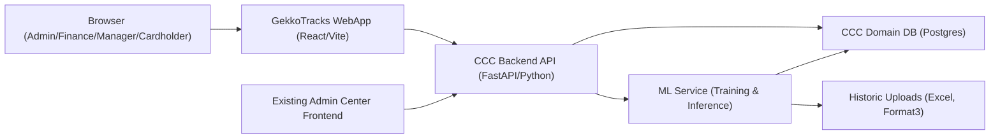

## Gekko Tracks – CCC Domain Architecture

This document describes the high-level architecture for the Credit Card Coding (CCC) domain as implemented by Gekko Tracks. It focuses on the CCC domain database, ERD, and API surface for Formats 1–3 and Admin Center integration.

For scope and milestones, see `PROJECT_CHARTER.md` and `Project_management_plan.md`.

---

### 1. High-Level System Architecture

At a high level, Gekko Tracks is a backend + frontend application built around a CCC domain database, with ML components and an Admin Center consumer.



- **Frontend (Gekko Tracks)**:
  - Role-aware navigation (Admin/Finance, Cardholder, Manager).
  - Screens for:
    - Ledger and import views (Format 1) – mostly for Admin/Finance.
    - Classification views (Format 2) – for Cardholders and Managers.
    - Finance/Pronto views (Format 3) – for Admin/Finance.
  - No dedicated Admin Center UI; instead, the existing Admin Center frontend links into CCC where needed.

- **Backend API (CCC Backend)**:
  - Exposes REST endpoints for:
    - Imports and ledger queries (Format 1).
    - Classifications and approvals (Format 2).
    - Finance/Pronto export flows (Format 3).
    - Usage and health metrics for Admin Center.
  - Integrates with an ML service for predictions and training triggers.

- **CCC Domain Database (Postgres)**:
  - Stores users, roles, cardholders, managers, accounts, transactions, classifications, finance extensions, ML predictions, and usage metrics.
  - Exposes logical views for Formats 1–3.

- **ML Service**:
  - Offline training using historic Excel data (Format 3) and later operational data.
  - Online inference exposed via internal APIs to the CCC backend.

- **Admin Center**:
  - Existing Admin Center frontend consumes CCC usage and health via dedicated backend endpoints.

---

### 2. CCC Domain ERD

The CCC domain uses a per-domain database (or schema). Core entities support raw imports (Format 1), classification (Format 2), and finance/Pronto views (Format 3).

```mermaid
erDiagram
  User {
    int id
    string name
    string email
    string external_id
    bool active
  }

  Role {
    int id
    string name  // Admin, Finance, Cardholder, Manager
  }

  UserRole {
    int user_id
    int role_id
  }

  Cardholder {
    int id
    int user_id
    string display_name
  }

  Manager {
    int id
    int user_id
  }

  CardholderManager {
    int cardholder_id
    int manager_id
  }

  Account {
    int id
    string bank_account_number
    int cardholder_id
    string label
  }

  ImportJob {
    int id
    string file_name
    string source_format  // FORMAT1_CSV, FORMAT3_XLSX
    string status         // pending, running, completed, failed
    int total_rows
    int error_count
    int initiated_by_user_id
    datetime started_at
    datetime completed_at
  }

  Transaction {
    int id
    int import_job_id
    int account_id
    int cardholder_id
    string bank_account
    date date
    string narrative
    decimal debit_amount
    decimal credit_amount
    decimal balance
    string raw_categories
    string serial
    datetime created_at
    datetime updated_at
  }

  Classification {
    int transaction_id
    string description
    string project
    string cost_category
    string gl_account
    string status        // unclassified, predicted, user_confirmed, manager_approved
    int last_updated_by_user_id
    datetime last_updated_at
    string source        // ml, user, manager
  }

  FinanceExtension {
    int transaction_id
    string account
    string reference
    decimal tax
    decimal amount
    string tax_code
    string cbs
    int export_batch_id
    bool ready_for_pronto
    datetime exported_at
  }

  ExportBatch {
    int id
    string format       // PRONTO_UPLOAD
    string file_name
    int record_count
    datetime created_at
    int created_by_user_id
  }

  MLPrediction {
    int id
    int transaction_id
    string field_name
    string predicted_value
    float confidence
    string model_version
    datetime predicted_at
  }

  UsageMetric {
    int id
    date period_start
    string metric_name
    float metric_value
  }

  User ||--o{ UserRole : has
  Role ||--o{ UserRole : has

  User ||--o{ Cardholder : may_be
  User ||--o{ Manager : may_be

  Cardholder ||--o{ CardholderManager : has
  Manager ||--o{ CardholderManager : manages

  Cardholder ||--o{ Account : owns
  ImportJob ||--o{ Transaction : imports
  Account ||--o{ Transaction : has
  Cardholder ||--o{ Transaction : incurs

  Transaction ||--|| Classification : classifies
  Transaction ||--|{ FinanceExtension : extends
  Transaction ||--o{ MLPrediction : predicted_by

  ExportBatch ||--o{ FinanceExtension : groups
```

Key patterns:

- `Transaction` is the base ledger record, closest to Format 1.
- `Classification` adds Format 2 fields (description, project, cost category, GL account).
- `FinanceExtension` adds Format 3 fields for finance/Pronto workflows.
- `MLPrediction` captures model output separately for auditability.
- `UsageMetric` stores aggregated metrics for Admin Center usage views.

---

### 3. Formats 1–3 as Database Views

To keep migrations additive and minimize downtime, the three formats are exposed as database views over the core tables.

#### 3.1 Format 1 – Raw Bank CSV (`view_format1_raw`)

Backed primarily by `Transaction`:

- `Bank Account` → `Transaction.bank_account`
- `Date` → `Transaction.date`
- `Narrative` → `Transaction.narrative`
- `Debit Amount` → `Transaction.debit_amount`
- `Credit Amount` → `Transaction.credit_amount`
- `Balance` → `Transaction.balance`
- `Categories` → `Transaction.raw_categories`
- `Serial` → `Transaction.serial`

This view is used by:

- Admin/Finance: for imports, raw ledger inspection, debugging.
- Cardholders/Managers: rarely, mostly for support/debugging.

#### 3.2 Format 2 – Classified Business View (`view_format2_classified`)

Backed by `Transaction` + `Classification`:

- `Date` → `Transaction.date`
- `Narrative` → `Transaction.narrative`
- `Debit Amount` → `Transaction.debit_amount`
- `Credit Amount` → `Transaction.credit_amount`
- `Description` → `Classification.description`
- `Project` → `Classification.project`
- `Cost Category` → `Classification.cost_category`
- `GL Account` → `Classification.gl_account`

This view is the main working surface for:

- Cardholders: classifying their own transactions.
- Managers: reviewing and approving classifications.
- Admin/Finance: global oversight and corrections.

#### 3.3 Format 3 – Finance / Pronto View (`view_format3_finance`)

Backed by `Transaction` + `Classification` + `FinanceExtension`:

- All Format 2 fields plus:
  - `Account` → `FinanceExtension.account`
  - `Reference` → `FinanceExtension.reference`
  - `Tax` → `FinanceExtension.tax`
  - `Amount` → `FinanceExtension.amount`
  - `Tax Code` → `FinanceExtension.tax_code`
  - `CBS` → `FinanceExtension.cbs`

This view is restricted to Admin and Finance, and is used for:

- Finance workflows and Pronto uploads.
- Export batch creation and reconciliation.

---

### 4. API Surface (High Level)

The API is grouped around the main domain concerns and is designed to evolve in an additive, minimal-downtime friendly way.

#### 4.1 Imports (Format 1)

Base path: `/api/imports`

- `POST /api/imports/format1`
  - Roles: Admin, Finance.
  - Upload a Format 1 CSV file and create an `ImportJob`.
  - Returns: `import_job_id`, initial status.

- `GET /api/imports`
  - Roles: Admin, Finance.
  - List import jobs with status and basic metrics.

- `GET /api/imports/{job_id}`
  - Roles: Admin, Finance.
  - Return details and error summary for an import job.

#### 4.2 Transactions / Ledger (Format 1 View)

Base path: `/api/transactions`

- `GET /api/transactions`
  - Roles:
    - Admin/Finance: all transactions, filterable.
    - Cardholder: only own transactions.
    - Manager: transactions for assigned cardholders.
  - Query parameters:
    - `cardholder_id`, `account_id`, `from`, `to`, `status`, etc.
  - Returns: rows from `view_format1_raw` plus internal IDs as needed.

#### 4.3 Classifications (Format 2)

Base path: `/api/classifications`

- `GET /api/classifications`
  - Roles:
    - Cardholder: their own Format 2 rows.
    - Manager: Format 2 rows for their cardholders.
    - Admin/Finance: all Format 2 rows.
  - Query parameters:
    - `status` (unclassified, predicted, user_confirmed, manager_approved), `from`, `to`, etc.

- `PUT /api/classifications/{transaction_id}`
  - Roles:
    - Cardholder: update Format 2 fields and mark as `user_confirmed`.
    - Manager: approve or override, mark as `manager_approved`.
    - Admin/Finance: full override.
  - Body:
    - Subset of Format 2 fields + desired status.

- `POST /api/classifications/{transaction_id}/predict` (optional, MVP+1)
  - Roles: Cardholder, Admin/Finance.
  - Trigger or refresh ML predictions for a specific transaction.

#### 4.4 Finance / Pronto View (Format 3)

Base path: `/api/finance`

- `GET /api/finance/transactions`
  - Roles: Admin, Finance only.
  - Returns rows from `view_format3_finance`.

- `POST /api/finance/export-batches`
  - Roles: Admin, Finance.
  - Create an `ExportBatch` from selected transactions (e.g. by date range).
  - Returns: `export_batch_id` and optional download link.

- `GET /api/finance/export-batches`
  - Roles: Admin, Finance.
  - List export batches.

- `GET /api/finance/export-batches/{batch_id}`
  - Roles: Admin, Finance.
  - Get batch metadata and possibly an export payload.

#### 4.5 Admin Center (Usage & Health)

Base path: `/api/admincenter`

- `GET /api/admincenter/health`
  - Roles: Admin, Finance, AdminCenter service account.
  - Returns:
    - Overall CCC status (ok/degraded/failing).
    - Component statuses (DB, ML service, imports, etc.).

- `GET /api/admincenter/usage`
  - Roles: Admin, Finance, AdminCenter service account.
  - Query parameters: `from`, `to`, `granularity=day|week`.
  - Returns:
    - Aggregated usage metrics from `UsageMetric` (imports, classification coverage, approvals, etc.).

#### 4.6 ML Service (Internal)

Base path: `/internal/ml` (not exposed to browsers)

- `POST /internal/ml/predict`
  - Called by the CCC backend.
  - Body: transaction context (narrative, amounts, cardholder, etc.).
  - Returns: predicted field values + confidence scores.

- `POST /internal/ml/train`
  - Trigger retraining using historic data (Format 3 Excel) and current classifications.

---

### 5. Minimal-Downtime Design Principles

The architecture is designed to allow incremental, low-risk evolution:

- **Additive DB migrations**:
  - New features prefer adding tables/columns or views rather than destructive changes.
  - When schema changes are required, they follow a two-step pattern:
    - Add new structures and dual-write if needed.
    - Migrate readers and remove old fields later.

- **Stable APIs**:
  - New behaviours are added via new endpoints or new fields in responses.
  - Existing endpoints are not changed in breaking ways without versioning.

- **Decoupled Admin Center**:
  - Admin Center interacts only via CCC APIs, not direct DB access.
  - CCC can evolve internally while keeping Admin Center contracts stable.

This should allow Gekko Tracks to grow while keeping downtime and integration risk low, even as the company and system become more complex.


